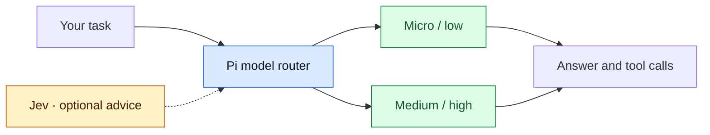

# pi-model-router

[](https://github.com/alexei-led/pi-model-router/actions/workflows/ci.yml)
[](https://www.npmjs.com/package/@alexeiled/pi-model-router)
[](LICENSE)

**Stop changing models by hand.**

Keep one profile in [Pi](https://github.com/earendil-works/pi/tree/main/packages/coding-agent).
`pi-model-router` can select a different model and reasoning effort for each new turn.
Optional Jev advice uses task context. You choose the available models and retain control.

## Why use it?

- **Fewer manual changes.** One profile can combine fast, low-cost routes with stronger models.
- **Control over cost and quality.** You choose the models, effort levels, fallback order, and baseline. You can pin a route at any time.
- **Stable tool calls.** A valid tool continuation keeps its route. The router does not ask an advisor for each tool result.
- **Visible decisions.** Pi shows the selected route, advisor outcome, cache tokens, and reported catalog cost.

The aim is selective use of expensive models, not the cheapest answer at any cost.
Savings depend on your profiles, task mix, output size, and cache reuse.
Jev adds advisor latency. Its fees are separate from generation costs.

## Let Jev advise the route

[Jev](https://typesafe.ai) is an optional decision model from TypeSafe.
It reads a bounded part of the conversation and advises a model and effort from your profile.
The selected model produces the answer. Jev does not produce it.



Jev needs your API key and approval for each profile. Selected text can contain private data.
Without an advisor, the router uses a compatible default route from your profile.
[Enable Jev and review the privacy boundary →](docs/jev-advisor.md)

## A turn in Pi

This illustrative footer shows a low-tier choice. It is not a routing promise or a latency benchmark.

```text
🚥 auto · low → gpt-6-luna/off · 🧭 Jev → low c91% · 807ms
```

The model answers and calls tools. Valid tool continuations keep that route without another Jev call.
For the next user turn, the router can select a different route.
[Read the status and take control →](docs/user-guide.md#understand-the-result)

Recent records cover 1,967 Pi responses across 25 sessions. They show route use, not guaranteed savings.
[See the chart, cost calculations, and limits →](docs/evaluation.md)

## Install

Requires Pi **0.86.0+** and Node.js **22.19.0+**.

```sh
pi install npm:@alexeiled/pi-model-router
```

Then start a new Pi session.
[Create a profile with your available models →](docs/user-guide.md#first-profile)

If you use the upstream package, remove it first. Both packages register the `router` provider.

---

Independent fork of [Ye Liu's pi-model-router](https://github.com/yeliu84/pi-model-router), with the original MIT license and attribution.
