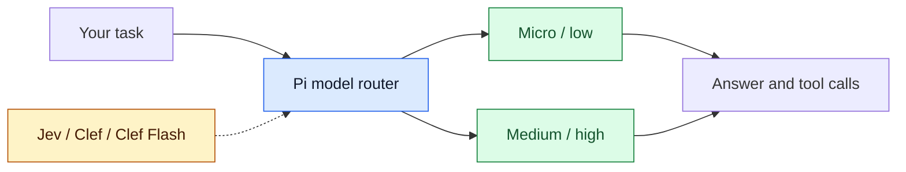
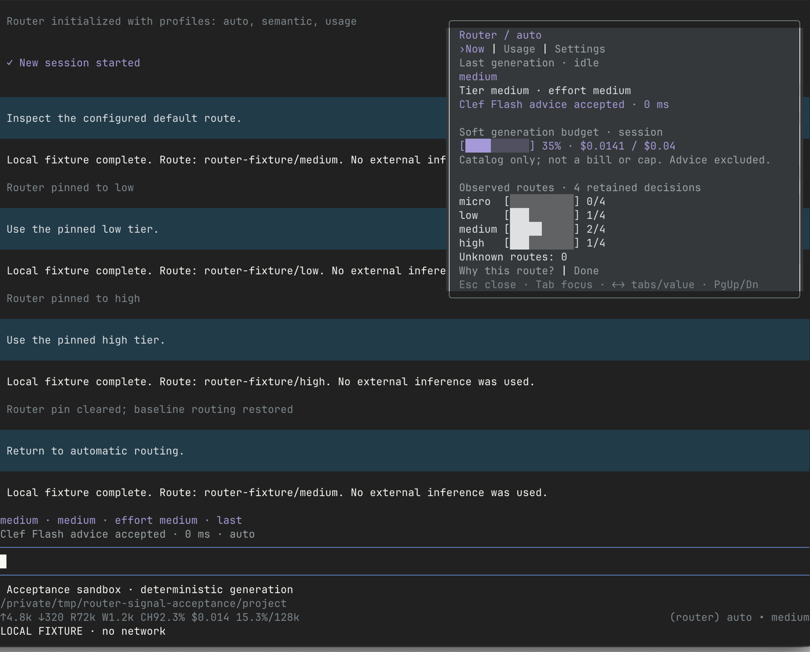

# pi-model-router

[](https://github.com/alexei-led/pi-model-router/actions/workflows/ci.yml)
[](https://www.npmjs.com/package/@alexeiled/pi-model-router)
[](LICENSE)

**Stop changing models by hand.**

Keep one profile in [Pi](https://github.com/earendil-works/pi/tree/main/packages/coding-agent).
`pi-model-router` can select a different model and reasoning effort for each new turn.
Optional Jev, Clef, or Clef Flash advice uses bounded task context. You choose the available models and retain control.

## Why use it?

- **Fewer manual changes.** One profile can combine fast, low-cost routes with stronger models.
- **Control over cost and quality.** You choose the models, effort levels, fallback order, and baseline. You can pin a route at any time.
- **Stable tool calls.** A valid tool continuation keeps its route. The router does not ask an advisor for each tool result.
- **Visible decisions.** A compact Signal Panel shows the actual model, effort and routing reason. Open `/router` for visual usage and session controls.

The aim is selective use of expensive models, not the cheapest answer at any cost.
Savings depend on your profiles, task mix, output size, and cache reuse.
Advisors add latency. Their fees are separate from generation costs.

## Optional routing advice

Choose [Jev](https://typesafe.ai), Clef or Clef Flash as an optional advisor.
It reads bounded recent context and advises a model and effort from your profile.
The selected generation model produces the answer, not the advisor.


```mermaid
flowchart LR
    Task["Your task"] --> Router["Pi model router"]
    Advisor["Jev / Clef / Clef Flash"] -.-> Router
    Router --> Light["Micro / low"]
    Router --> Strong["Medium / high"]
    Light --> Answer["Answer and tool calls"]
    Strong --> Answer
    classDef policy fill:#dbeafe,stroke:#2563eb,color:#0f172a
    classDef advisor fill:#fef3c7,stroke:#b45309,color:#451a03
    classDef generation fill:#dcfce7,stroke:#15803d,color:#14532d
    class Router policy
    class Advisor advisor
    class Light,Strong generation
```

Jev needs TypeSafe authentication through Pi (`/login typesafe`) and approval for each profile. Selected text can contain private data.
Without an advisor, the router uses a compatible default route from your profile.
[Jev setup and privacy →](docs/jev-advisor.md) · [Clef / Clef Flash setup →](docs/cloudflare-advisor.md)

## Inspect routing in Pi

Run **`/router`**. The Signal Panel has three sections: **Now**, **Usage** and **Settings**.
Open `/router usage` or `/router settings` directly; `/router status` returns short text.
The two-line strip is on in new sessions. `/router widget` switches to a quiet footer status instead.



Captured from the local dev extension in Pi inside agterm, using synthetic fixture data.
[Inspector controls](docs/user-guide.md#native-inspector) · [Cloudflare setup](docs/cloudflare-advisor.md)

## A turn in Pi

This illustrative strip shows a low-tier choice after completion. It is not a routing promise or a latency benchmark.

```text
gpt-6-luna · low · effort off · last
Clef advice accepted · 807 ms · auto
```

The model answers and calls tools. Valid tool continuations keep that route without another advisor call.
For the next user turn, the router can select a different route.
[Read the status and take control →](docs/user-guide.md#understand-the-result)

Recent records cover 1,967 Pi responses across 25 sessions. They show route use, not guaranteed savings.
[See the chart, cost calculations, and limits →](docs/evaluation.md)

## Upgrading to 0.11.0

After updating, restart Pi. Replace `/router-ui` with `/router`, and
`/router <profile>` with `/router profile <name>`. Routing and Classifier settings
now share `/router settings`. Routing policy and privacy approval are unchanged.
[Command migration →](docs/user-guide.md#from-010x-to-0110)

Coming from 0.9.x? First follow the [Jev authentication migration](docs/jev-advisor.md#migrate-the-old-router-fields).

## Install

Requires Pi **1.0.2 or later in the 1.x series** and Node.js **22.19.0+**.
The test suite checks Pi 1.0.2 types and isolated RPC startup. The native UI was also exercised in Pi 1.0.4 inside agterm; see the [acceptance evidence](docs/testing/signal-panel-acceptance.md).

```sh
pi install npm:@alexeiled/pi-model-router
```

Then start a new Pi session.
[Create a profile with your available models →](docs/user-guide.md#first-profile)

If you use the upstream package, remove it first. Both packages register the `router` provider.

---

Independent fork of [Ye Liu's pi-model-router](https://github.com/yeliu84/pi-model-router), with the original MIT license and attribution.
