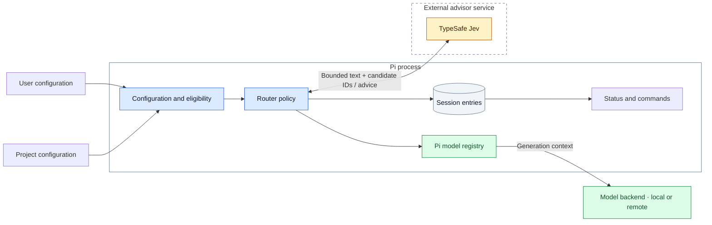
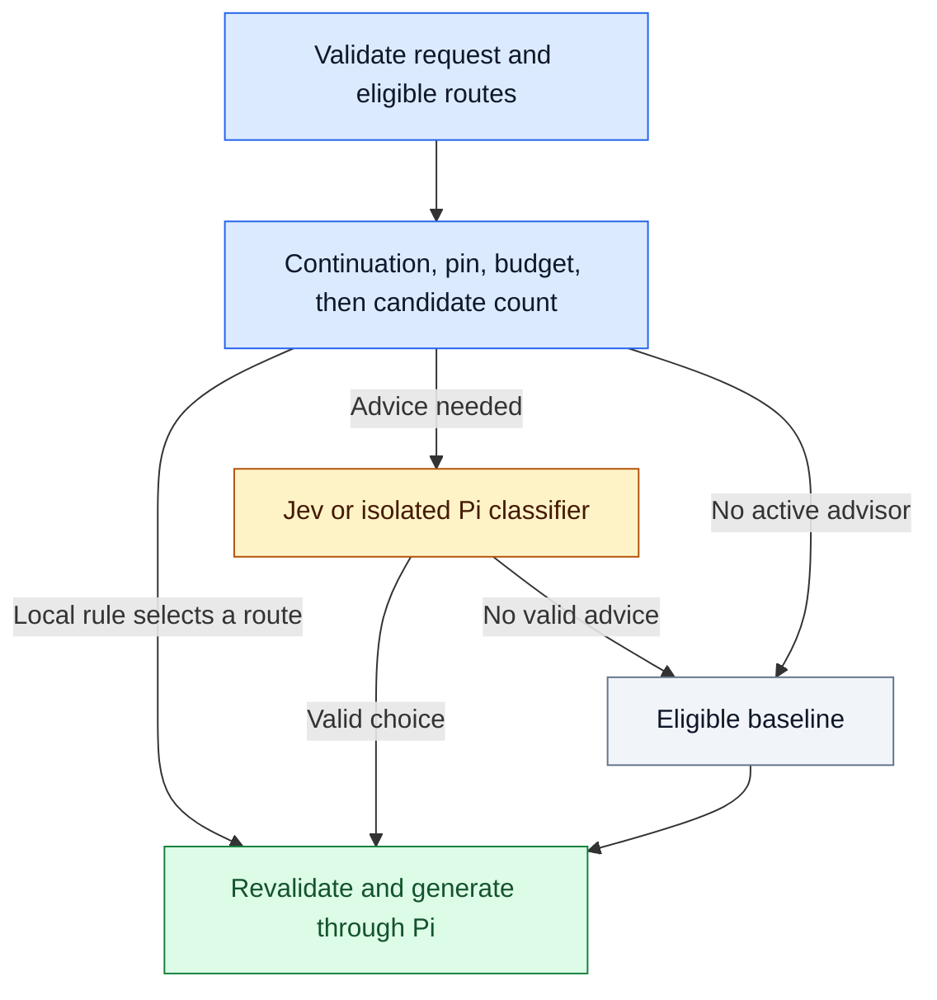
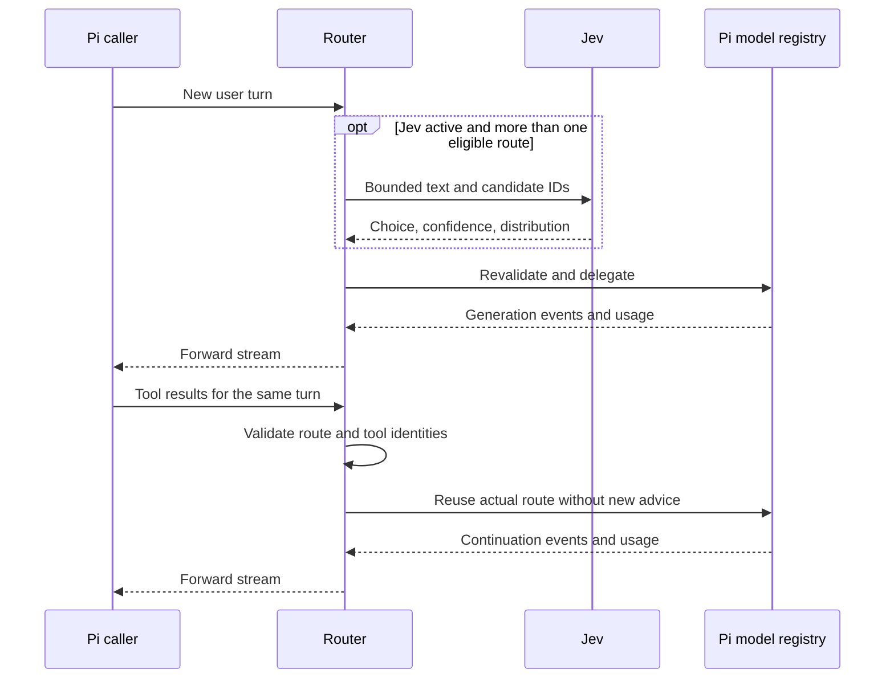

# Architecture

The router is a Pi extension, not a proxy or a second agent runtime.
It keeps `router/<profile>` selected while Pi delegates each request to a concrete model.

## Boundaries

Blue marks routing policy, amber marks advice, green marks generation, and gray marks local state or baseline.
Node labels identify each role without color.

| Owner | Responsibility |
| --- | --- |
| Router | Profile policy, eligible routes, advisor calls, explicit fallbacks, and diagnostics. |
| Pi | Authentication, credential-specific URLs, provider dispatch, transcript conversion, and tool permissions. |
| Jev | Advice among eligible tier candidates. It cannot add models or authorize tools. |
| Operator | Model configuration, provider access, and per-profile approval for external context. |

The router never reads private authentication storage or claims to identify the provider account behind a login.
Only the Jev advisor uses a separate HTTPS credential.
Project configuration cannot enable Jev or inherit approval for a new profile.

## Route selection

A valid continuation reuses its actual route. An invalid continuation selects a compatible local route without advice.
Pins, budget policy, and only one eligible candidate also bypass advisors.
The budget is a soft generation-cost policy, not a billing cap.

Eligibility requires provider availability, input support, and exact effort support.
Local declarations can restrict registry capabilities but cannot grant capabilities.
The router never reduces an explicit unsupported effort level silently.

An eligible `baselineTier` takes priority. The remaining preference is `medium`, `high`, `low`, then `micro`.
Each tier offers at most one advisor candidate: its primary, or its first eligible fallback when the primary is ineligible.
Explicit fallback models retain their configured order. They are not extra Jev candidates.
Prompt words, language, length, and inferred task phase never select a local tier.

## Advisor contract

Jev receives bounded current text, recent dialogue, and permitted tool evidence.
It never receives system prompts, tool definitions, thinking blocks, tool arguments, binary blocks, or raw configuration.
Selected text can still contain private data. Filtering is not redaction.

A candidate ID represents the tier, canonical model, and effort.
The adapter rejects unknown IDs, invalid confidence, malformed distributions, and oversized responses.
It accepts only a current candidate. The [Jev guide](jev-advisor.md#acceptance-policy) defines probability selection.

One absolute deadline covers context preparation, HTTP attempts, backoff, and response reading.
Only documented transient statuses qualify for a retry inside that deadline.
The Pi classifier has a separate deadline and no retry.

## Route reuse and generation

Concurrent callers for one turn share the advisor request and its deadline.
Only the last departing caller can cancel the shared transport.
The bounded cache stores the actual successful route, not only the advisor label.

Reuse requires matching session, user turn, profile, policy, configuration, branch ancestry, model, and tool-result identities.
When the caller omits `sessionId`, the key uses Pi's native session ID.
Changed capabilities or configuration invalidate reuse. The original provider `sessionId` passes through unchanged.
Context truncation removes complete old user turns and preserves system instructions and the active tool chain.
Its text estimate does not guarantee a fit for images or oversized active turns.

## Failure behavior

| Event | Router action | Boundary |
| --- | --- | --- |
| Jev times out, abstains, or returns invalid advice. | Select the eligible baseline. | Do not call a second advisor. |
| An explicit pin has no eligible route. | Return an error. | Do not substitute another tier. |
| The caller cancels. | Stop the request. | Do not start baseline generation or retry. |
| Generation fails before visible content. | Try the next configured fallback, or return an error. | Revalidate the target and account for reported costs. |
| Generation fails after visible content. | End the response with an error. | Do not retry on another model. |
| The stream ends without a terminal event. | Return an incomplete-stream error. | Apply the same visibility and cancellation limits to retries. |
| A Google thought-signature continuation loses its compatible prior model. | Fail the continuation. | Do not send it to an incompatible model. |

## State and cost

| State | Lifetime | Contents |
| --- | --- | --- |
| Runtime route cache | Current process | Turn hashes, branch identity, tool IDs, shared advice, and eligible routes. |
| `router-state` entries | Pi session branch | Profile, pins, cost, display controls, latest decision, and up to 50 debug decisions. |
| Profile preference file | Across sessions | Last explicitly selected profile. Explicit startup selection takes priority. |

Snapshots use deep copies and field-level validation.
They exclude raw advisor responses, prompts, credentials, endpoints, and remote explanations.
Local Jev request IDs support deduplication within retained history. They are not provider authentication or cache-affinity IDs.

Every terminal attempt contributes its reported cost before a fallback decision.
Missing usage remains unknown. Advisor costs are outside the generation budget.
The final UI update cannot prevent persistence.

`economics.ts` compares catalog prices on the same measured token workload.
This comparison never affects route selection. It stores no physical cache state or guessed TTL.
A restored branch does not restore a server cache. Same-model effort changes do not imply cache preservation.
The [evaluation](evaluation.md#cost-method) states the cost assumptions and evidence limits.

## Module ownership

| Module | Responsibility |
| --- | --- |
| `index.ts` | Wire Pi lifecycle events and runtime state. |
| `config.ts` | Load, merge, validate, and normalize configuration. |
| `provider.ts` | Own route flow, advisor deadlines, continuation reuse, and delegation. |
| `routing.ts` | Apply baseline, pin, budget, input, and effort policy. |
| `context.ts` | Select bounded advisor text and extract generation input. |
| `jev.ts`, `classifier.ts` | Call and validate their respective advisors. |
| `economics.ts` | Produce generation metrics and hypothetical cost comparisons. |
| `state.ts` | Validate and copy branch-safe snapshots. |
| `commands.ts`, `ui.ts` | Accept operator controls and show state. |
| `types.ts` | Define shared contracts. |

`provider.ts` calls policy and advisor modules. Advisors do not own provider state or UI behavior.
State and UI do not call Jev. Generation uses Pi's registry rather than a parallel authentication layer.

Strict TypeScript, Biome import-cycle checks, and behavior tests protect these boundaries.
Integration tests use real Pi event streams and in-memory providers. Jev tests use synthetic HTTP fixtures, not live credentials.
