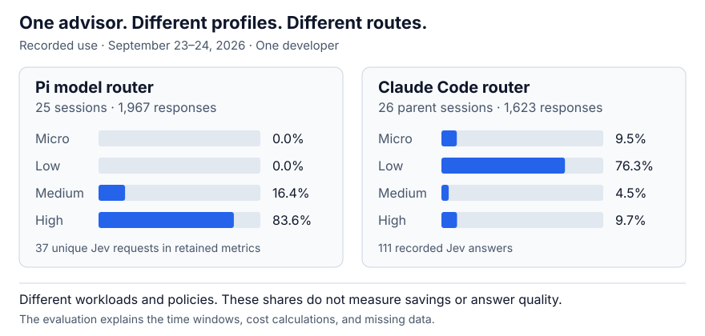

# Evaluation

This snapshot describes one developer's Pi and Claude Code use on September 23–24, 2026.
Both routers used Jev. The workloads, profiles, and routing policies differed.
This is not a product comparison or a model-quality benchmark.

## Recorded routes



| Tier | Pi responses | Pi share | Claude Code responses | Claude Code share |
| --- | ---: | ---: | ---: | ---: |
| Micro | 0 | 0.0% | 154 | 9.5% |
| Low | 0 | 0.0% | 1,239 | 76.3% |
| Medium | 322 | 16.4% | 73 | 4.5% |
| High | 1,645 | 83.6% | 157 | 9.7% |
| **Total** | **1,967** | **100%** | **1,623** | **100%** |

Pi covered 25 sessions. Claude Code covered 26 parent sessions and 29 conversation keys, with subagents counted separately at the conversation level.
A response is a recorded generation result, not a new user prompt. Most Pi results were tool calls.
Two Pi responses ended with errors. This count does not measure answer quality.

The Pi profiles mostly selected high. The Claude profiles mostly selected micro or low.
A router can preserve stronger routes without forcing cost reduction on every turn.

## Jev overhead

| Available evidence | Pi | Claude Code |
| --- | ---: | ---: |
| Retained unique Jev request IDs | 37 | Not recorded in this format |
| Recorded Jev answers | 37 unique requests | 111 advice records |
| Reported Jev input tokens | 77,341 | Not recorded |
| Median local Jev latency | 437 ms | Not recorded |
| 95th-percentile local Jev latency | 1,158 ms | Not recorded |

Pi snapshots repeat advisor metrics during route reuse. The count deduplicates request IDs across snapshots and retained history.
It does not count each tool continuation as a new Jev request.
Older records without request IDs cannot establish a complete advisor-call total.
Jev fees and unreported requests are outside these measurements.

## Cost method

| Quantity | USD | Meaning |
| --- | ---: | --- |
| Pi reported catalog cost | 377.19 | Sum of matched assistant `usage.cost.total` values. Historical registry prices remain unchanged. |
| Claude reconstructed generation cost | 142.24 | Model-specific list prices applied to observed token counters and recorded cache TTL. |
| Claude all-Opus scenario | 178.31 | Same input, cache-read, and output counters, repriced as Opus 5.5. |

The Claude scenario has a $36.07 tariff difference, or 20.2% of the all-Opus total.
**This is not measured savings.** It holds cache behavior and output size fixed across different models.
An actual fixed-model run can retain more cache, produce different output, or require different retries.
The scenario is neither an upper nor a lower bound on real savings.

The reconstruction treats uncached Claude input as a cache write.
Its multiplier is 1.25 for a five-minute TTL and 2 for a one-hour TTL.
The logs do not provide a complete invoice or separate ordinary input from every cache write.

```text
Claude cost = (
  cacheWrite5mTokens × inputRate × 1.25
  + cacheWrite1hTokens × inputRate × 2
  + cacheReadTokens × cacheReadRate
  + outputTokens × outputRate
) / 1,000,000
```

Rates are USD per million tokens, from the router's dated
[list-price fixture](https://github.com/alexei-led/claude-router/blob/v0.6.1/test/fixtures/list-prices.json), dated September 23, 2026.

| Model | Input | Cache read | Output |
| --- | ---: | ---: | ---: |
| Haiku 4.5 | 1.00 | 0.10 | 5.00 |
| Sonnet 5 | 2.00 | 0.20 | 10.00 |
| Opus 5.5 | 4.00 | 0.20 | 20.00 |

Pi's reported values and Claude's reconstructed values use different methods. Their totals do not rank the two products.
Subscription prices, Jev fees, operator time, and answer quality are not part of these figures.

### The extension's shadow comparison

The live Pi extension uses current registry base rates, not this historical report.
Its scenarios use disjoint Pi input counters and the measured output count:

```text
I = input + cacheRead + cacheWrite
O = output
allRead(model) = (I × cacheReadRate + O × outputRate) / 1,000,000
allNew(model) = (I × max(inputRate, cacheWriteRate) + O × outputRate) / 1,000,000
```

The maximum permits a catalog without separate cache-write pricing.
These scenarios omit long-context price tiers, retention differences, and changes in output length.
They do not affect routing. Unknown tariffs remain unknown.

## Scope and reproducibility

- **Pi window:** September 23 at 00:00 UTC through September 24 at 06:00 UTC, with the end excluded.
- **Claude window:** September 23 at 09:05 UTC through the same end. This window uses Opus 5.5, Sonnet 5, and Haiku 4.5.
- **Pi selection:** Native session entries with the router selected. The latest route must match the assistant provider and model.
- **Pi deduplication:** Session, entry ID, message timestamp, and model identify each response. Request IDs identify retained Jev calls.
- **Claude selection:** Every `observed` record inside its window, with valid model and tier fields. Subagent and service responses remain included.
- **Claude advice:** Entries with an `advice` object. These records do not expose billable Jev input usage.

This snapshot uses retained logs from the default Pi session directory and the active Claude gateway log.
It does not cover deleted logs, rotated logs, or other agent directories.
The local session files contain conversation text. This analysis extracted only routing and usage metadata.
The published [aggregate data](assets/usage-data.json) contains no prompts, credentials, local paths, or session and request IDs.
It includes tier counts, token totals, cache-write totals by TTL, rates, and cost sums.

The SVG in this report uses these counts. It does not use inferred task quality or projected output growth.
Numbers from other snapshots can differ because their cutoff, filters, tariffs, or cache assumptions differ.

## What this establishes

The records show actual use of different configured routes and bounded advisor overhead.
They do not establish a universal return on investment.
A useful savings study needs comparable tasks, measured quality, actual provider costs, and a fixed-model control run.
Stronger models do not necessarily produce more output. No savings claim here depends on that assumption.
