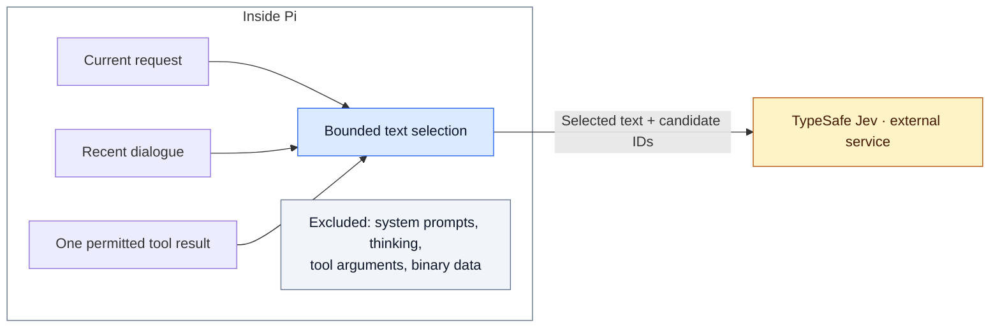
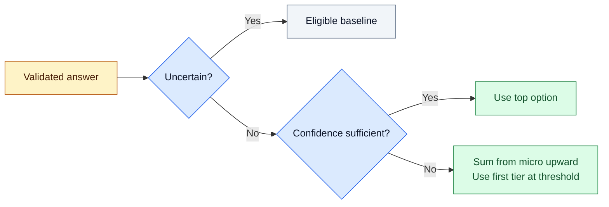

# Jev guide

Jev advises one eligible model/effort pair for a new user turn.
The router validates that advice. Pi runs the selected model and all tools.

## Enable Jev

CAUTION: Approve external text transfer before you enable a profile. Selected conversation text can contain secrets or private data.

1. Get a TypeSafe API key.
2. Add these fields to your user `model-router.json` and its existing `auto` profile.
3. Replace the key placeholder.

```json
{
  "jev": { "enabled": true, "apiKey": "<your-api-key>" },
  "profiles": { "auto": { "jev": { "enabled": true } } }
}
```

4. Keep the existing model definitions in that profile.
5. Run `/router reload`.
6. Run `/router auto`.
7. Send a new request.
8. Run `/router` to inspect the advisor result.

If your profile has another name, use that name instead of `auto`.
With multiple eligible routes and no bypass, status shows a Jev choice or a reason for baseline fallback.
The [user guide](user-guide.md#understand-the-result) explains the result fields.

Both global enablement and explicit profile approval are required.
Project Jev fields have no effect. Work profiles have no automatic approval.
[Profile configuration](user-guide.md#first-profile) belongs in the user guide.

### Store the key

Keep the rendered configuration out of Git. Restrict file access to its owner, for example with mode `0600`.
A secret manager can render `apiKey` before Pi starts.
The extension does not run secret-lookup commands or require an environment variable.

## Privacy boundary



The request has three text fields: `currentRequest`, `recentDialogue`, and `recentToolEvidence`.
It also includes candidate tier, model, and effort identifiers.
Raw configuration, configuration credentials, and tool definitions do not enter the selected text.

This filter is not redaction. Text from a user, assistant, or tool can still contain sensitive data.
TypeSafe states that customer requests do not train Jev. Zero data retention is an enterprise option, not the default.
[TypeSafe's legal terms](https://docs.typesafe.ai/legal) define the service policy.

## Configuration reference

All fields in this table belong under user-level `jev`.
Partial `context` and `retry` objects inherit defaults.
Invalid values or unknown nested keys reject the Jev configuration with a value-free warning.

| Field | Default | Range or behavior |
| --- | --- | --- |
| `enabled` | `false` | Needs `apiKey` and explicit profile approval. |
| `endpoint` | `https://api.typesafe.ai/v1/systemone` | HTTPS only. No embedded credentials, query, or fragment. |
| `model` | `jev-1.13.0` | A versioned ID keeps the model fixed. `jev-latest` can change without a configuration edit. |
| `timeoutMs` | `1500` | Total advisory budget. Positive milliseconds, at most 2147483647. |
| `confidenceThreshold` | `0.65` | From 0 through 1. Controls direct acceptance of the top option. |
| `probabilityThreshold` | `0.8` | Greater than 0, at most 1. Controls cumulative probability selection. |
| `maxStateTokens` | `3000` | Local state-token estimate, from 1 through 24000. |
| `context.previousTurns` | `2` | From 0 through 20 prior user turns. |
| `context.maxHistoryTokens` | `500` | Shared dialogue estimate, from 0 through 24000. |
| `context.toolResults` | `"last-error"` | `"none"`, `"last"`, or `"last-error"`. |
| `context.maxToolTokens` | `250` | Tool-text estimate, from 0 through 24000. |
| `retry.maxAttempts` | `2` | Total HTTP attempts, from 1 through 5. A value of 1 disables retries. |
| `retry.backoffMs` | `400` | Initial delay, from 0 through 60000 milliseconds. |
| `mode` | `"advisory"` | The only supported mode. |

The same deadline covers request preparation, HTTP, response reading, and retry delays.
Only `408`, `429`, and `5xx` qualify for retries. A retry needs enough remaining time for a full round trip.
The delay doubles per retry and respects `Retry-After`.
Permanent errors, invalid response bodies, and caller cancellation do not trigger retries.

## Context selection

The current request takes priority, then recent dialogue, then tool evidence.
The individual limits never increase `maxStateTokens`.
Long text retains its beginning and end, with an explicit truncation flag.

Each prior turn contributes its last non-empty assistant reply.
Empty, thinking-only, and tool-call-only replies do not consume dialogue slots.
Only the last tool result of the immediately previous user turn is eligible.

`last-error` uses Pi's native `isError` flag. It does not search text for error words or recover an older failure.
For tools that report failures without that flag, `"last"` includes their latest result but sends more text.

| Task pattern | Example override under `jev.context` |
| --- | --- |
| Independent requests | `{ "previousTurns": 0, "toolResults": "none" }` |
| Dialogue without tool output | `{ "previousTurns": 2, "toolResults": "none" }` |
| Tool diagnosis | `{ "toolResults": "last", "maxToolTokens": 500 }` |
| Longer follow-ups | `{ "previousTurns": 4, "maxHistoryTokens": 1000 }` |

TypeSafe publishes no Jev tokenizer or token-count endpoint.
The router uses a conservative estimate and rejects requests with more than 28000 estimated tokens before HTTP.
This leaves room within Jev's 32000-token state-plus-question limit.
Diagnostics show both estimated tokens and reported input tokens.
Generation still receives Pi's normal context, not the reduced Jev context.

The [context study](research/jev-context-selection.md) explains the defaults. More history did not improve every task.

## Acceptance policy

Jev receives structured criteria for each tier and an `uncertain` option.
The criteria favor correctness and less rework. Simple retrieval and mechanical tasks favor lower tiers.
Confidence describes the choice distribution, not the probability that the generation model will answer correctly.



Abstention mass counts for the baseline tier in the cumulative calculation.
A higher probability threshold favors stronger tiers. A lower threshold does not mean an argmax rule.
Only current eligible candidates can win. Invalid advice or a timeout selects the baseline without a second advisor.
The [policy study](research/jev-routing-policy.md) records the supporting experiment and its limits.

### Bypass and fallback

A pin, budget policy, only one eligible [candidate](architecture.md#route-selection), or a valid tool continuation bypasses advice.
An invalid continuation selects a compatible local route without advice.

When Jev is inactive, an optional Pi classifier can advise the route instead.
A failed Jev call never activates that classifier.
Without an active advisor, the router selects its eligible baseline.
A profile with an eligible `baselineTier: "high"` favors high on fallback. Confident lower-tier advice still takes priority.

## Diagnostics

| Display | Meaning |
| --- | --- |
| `Jev → high c91% · 807ms` | Direct high selection, with confidence and local latency. |
| `Jev medium c35% <65% → high` | Probability selection changed the acted-on tier from the top option. |
| `p48%` | Probability of the top option, not confidence. Detailed mode also shows the request start. |
| `selected`, `basis`, `route-p` | Acted-on tier, selection rule, and cumulative probability. |
| `reuse` or `tool route` | No new advisor request. Metrics refer to the original request. |
| `advice skipped: …` | A local policy bypassed the advisor. |
| `no tier chosen → baseline` | Jev abstained. The baseline is not necessarily medium. |

The widget shows model labels, HTTP status, attempt count, candidate count, limits, and input usage.
The [decision log](user-guide.md#command-reference) retains 50 decisions and deduplicates local request IDs within that window.
Its request count is not a session-lifetime billing counter.

Local outcomes include `selected`, `uncertain`, `invalid-response`, `http-error`, `network-error`, `deadline`, `cancelled`, `unavailable`, and `input-too-large`.
An invalid response includes a local code such as `distribution-sum`, `unknown-choice`, or `invalid-confidence`.
Raw response text does not enter the log.

## Troubleshooting

| Symptom | Action |
| --- | --- |
| Only one tier is eligible | Make sure that the other tiers' models exist in `/model` and support the input. |
| Missing user API key | Add the rendered key to user configuration, not project configuration. |
| Frequent deadlines | Increase `timeoutMs`, for example to 3000. This permits more delay before fallback. |
| HTTP `401` | Make sure that the key is correct and active. |
| HTTP `422` | Report the local diagnostics. Do not attach private request text. |
| HTTP `429` or `529` after retry | Reduce request rate or retry later. The provider reports a limit or overload. |
| Invalid response | Report the local response code. A longer timeout does not correct a schema error. |
| Ambiguous follow-up selects baseline | Add the missing reference to the request. Abstention is an expected result. |
