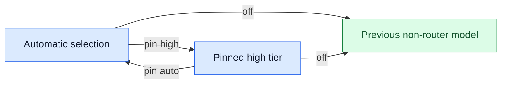

# User guide

A profile maps up to four tiers to models and reasoning effort.
The tiers are `micro`, `low`, `medium`, and `high`. They do not control tool permissions.
Pi supplies the providers, credentials, and tool permissions.

## First profile

1. Open Pi's `/model` selector to find available models.
2. Authenticate the chosen providers through Pi.
3. Create `~/.pi/agent/model-router.json`.
4. Add a profile to that file.

This example uses illustrative model references. Replace them with models and effort levels that your Pi registry supports.

```json
{
  "profiles": {
    "auto": {
      "baselineTier": "high",
      "high": { "model": "openai/gpt-6-astra", "thinking": "high" },
      "low": { "model": "openai/gpt-6-luna", "thinking": "off" }
    }
  }
}
```

5. Run `/router reload`.
6. Run `/router auto`.
7. Send a short request, such as `Reply with ready.`
8. Run `/router` to inspect the result.

With this profile and no active advisor or pin, the compact footer has this form:

```text
🚥 auto · high → gpt-6-astra/high · local baseline
```

The high route is the configured default, called the baseline. Prompt words do not select a cheaper local route.
If no route appears, use the [problem table](#common-problems).

## Understand the result

| Footer field | Meaning |
| --- | --- |
| `auto` | The selected profile name. It stays selected across model changes. |
| `high` | The tier used for this request. |
| `gpt-6-astra/high` | The model and reasoning effort selected for generation. |
| `local baseline` | No advisor selected the route. |
| `🧭 Jev → low c91% · 807ms` | Jev selected low with 91% confidence in this illustrative example. The advisor took 807 ms. |
| `reuse` | The router reused advice. The displayed advisor metrics belong to the original request. |
| `[fallback]` | Generation used an explicit alternative model. |

Confidence is not the probability of a correct answer.
`/router` shows more detail. The [Jev guide](jev-advisor.md#diagnostics) explains probability selection, abstention, and advisor errors.

## Try Jev next

1. Review the [privacy boundary](jev-advisor.md#privacy-boundary).
2. [Enable Jev](jev-advisor.md#enable-jev) for the same `auto` profile.
3. Send a new request.
4. Run `/router` again.

With multiple eligible routes and no policy bypass, status shows Jev advice or a reason for baseline fallback.
The selected tier can still be high. Different wording does not guarantee a different tier.

### Example session

These outcomes illustrate the flow. They are not fixed rules for particular prompts.

| Event | Example result |
| --- | --- |
| A new user request arrives. | Jev advises low. The router validates that choice and selects the low model. |
| The model receives a tool result. | A valid continuation keeps the actual route without another advisor call. |
| The user sends a new request. | The router can ask Jev again and select high. |
| The user pins high. | Later requests use the high tier and its explicit fallbacks without advice. |

## Take control



- Run `/router pin high` to restrict selection to high.
- Run `/router pin auto` to clear the pin.
- Run `/router off` to return to the previous non-router model.

Here, `auto` is a profile name. The argument in `pin auto` clears a pin instead.
An ineligible pin produces an error. The router does not substitute another tier.

An effort override applies to every tier in the active profile.
Pi's thinking selector, such as Shift+Tab, sets the same override.
An override that removes every eligible route produces an error without a partial configuration change.
Use `/router thinking auto` to clear the override.

## Common problems

| Symptom | Action |
| --- | --- |
| No eligible route | Make sure that the model exists in `/model` and supports the input and effort. |
| Only high remains eligible | Run `/router thinking auto`, or choose models that support the override. |
| The baseline handles every request | Inspect `/router`. Enable an advisor for semantic selection, or clear a pin. |
| Jev does not run | Inspect the bypass reason and the [Jev diagnostics](jev-advisor.md#diagnostics). |
| Old behavior after an extension change | Start a new Pi session. |
| Provider context overflow | Reduce the active context. Text estimates cannot guarantee that images or a large tool turn fit. |

## Command reference

| Command | Action |
| --- | --- |
| `/router` | Show the current profile, route, costs, and diagnostics. |
| `/router <profile>` | Select a profile and enable the router. |
| `/router off` | Restore the previous non-router model. |
| `/router pin <tier\|auto>` | Pin a tier or return to automatic selection. |
| `/router thinking <level\|auto>` | Override effort for the profile or clear the override. |
| `/router log [on\|off\|clear]` | Show recent decisions, control collection, or clear history. |
| `/router widget` | Toggle the status widget. |
| `/router reload` | Load the configuration again. |
| `/router help` | Show command help. |

Per-tier effort belongs in the profile configuration.
Removed commands such as `status`, `profile`, `fix`, and `debug` show their replacements and do not change state.

## Configuration reference

| File | Purpose |
| --- | --- |
| `~/.pi/agent/model-router.json` | User configuration and Jev approval. A custom Pi agent directory changes this location. |
| `.pi/model-router.json` | Project overrides for local routes and display. Project Jev configuration has no effect. |
| `~/.pi/agent/model-router-state.json` | Last selected profile. The extension manages this file. |

CAUTION: Keep credentials out of Git. Selected conversation text can contain secrets even with bounded advisor context.

A profile needs at least one tier. A partial profile is valid.
A profile named after a `/router` verb produces a warning. `/router <name>` runs the verb, not the profile.
The router filters unavailable models, unsupported input, and unsupported effort before selection.
`baselineTier` prefers a configured tier. Without it, the preference is `medium`, `high`, `low`, then `micro`.
The [complete example](../model-router.example.json) shows aliases, all four tiers, and explicit fallbacks.

| Field | Behavior |
| --- | --- |
| `maxSessionBudget` | Soft threshold for reported generation cost. Unpinned requests skip advisors and prefer eligible medium-or-lower tiers after this threshold. |
| `classifierModel` | Optional Pi classifier, active only when Jev is inactive. Accepts a model reference or `{ "model", "thinking", "timeoutMs" }`. |
| `models` | Aliases with a `model` reference and optional `contextWindow` and `maxTokens`. |
| `ui.statusLine` | `compact` by default. `detailed` adds advisor probability, request time, and cache counters. |

The budget is not a spending cap. It excludes advisor costs, and a pin takes priority.
Without an eligible lower tier, the budget policy keeps an eligible baseline.
The classifier timeout defaults to 10 seconds. A classifier error selects the baseline.

## Read costs and cache data

After a terminal response, the widget and log show:

- Input, output, cache-read, and cache-write tokens for the last terminal attempt.
- The model transition and the total attempt count.
- Reported catalog cost across attempts, with failed attempts included.
- Hypothetical stay/switch prices for the same measured tokens.

An attempt without terminal usage makes the request total unknown. The session total still includes known costs.
Zero placeholder tariffs do not establish free generation.
Catalog prices do not establish subscription charges.

The shadow comparison does not control routes or predict savings.
It assumes either all-cache-read input or all-new input, plus the same output tokens.
Missing tariffs, an unknown previous model, and router-side truncation suppress the comparison.
The [evaluation](evaluation.md) separates observed use from hypothetical cost.

## Sessions and history

Pins, costs, display controls, and recent decisions follow the Pi session branch.
Debug collection retains the last 50 decisions. Turning collection off preserves existing history and the latest decision.

An explicit startup `--model` takes priority.
Otherwise, a resumed branch uses its saved state.
When Pi starts on the router provider, a new session uses the last profile.
A restored router snapshot does not restore a server cache.

## Migration

CAUTION: Do not load this fork and the upstream extension together. Both register the `router` provider.

```sh
pi remove npm:@yeliu84/pi-model-router
pi install npm:@alexeiled/pi-model-router
```

If a manifest loads the upstream extension, remove that entry instead.
Existing profiles remain usable. Deprecated `rules` and `phaseBias` produce a warning but have no routing effect.
