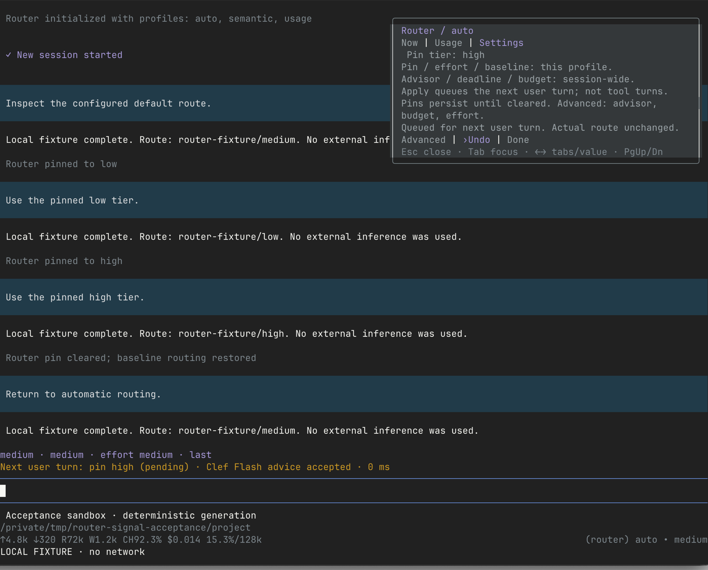
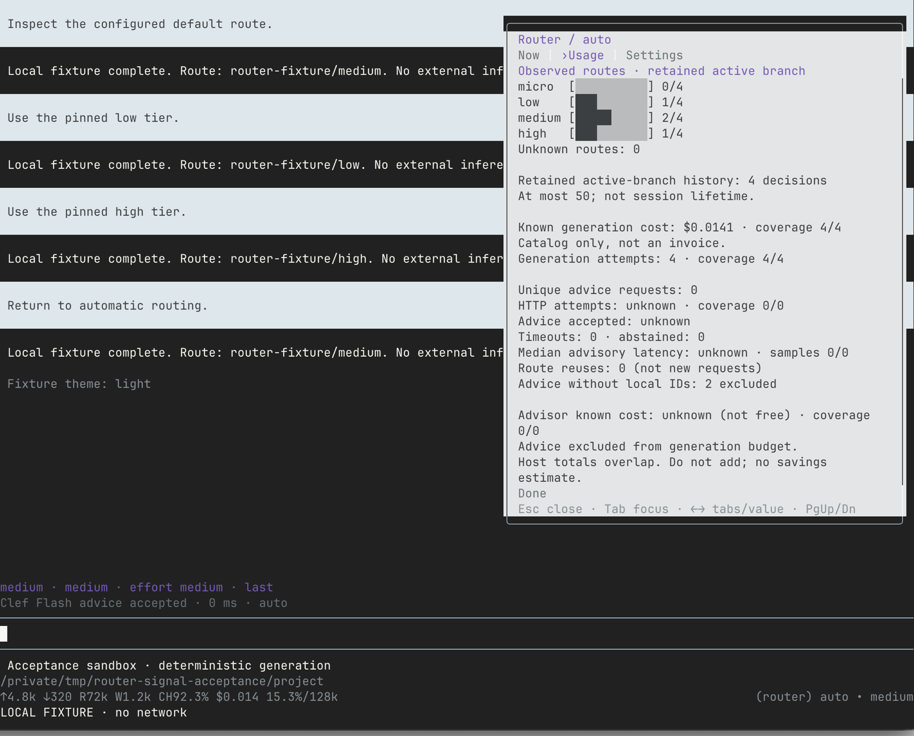
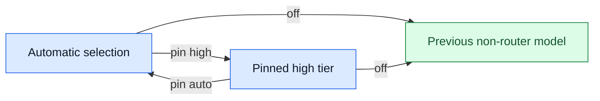

# User guide

A profile maps up to four tiers to models and reasoning effort.
The tiers are `micro`, `low`, `medium`, and `high`. They do not control tool permissions.
Pi supplies the providers, credentials, and tool permissions.

## First profile

1. Open Pi's `/model` selector to find available models.
2. Authenticate the chosen providers through Pi.
3. Create `~/.pi/agent/model-router.json`.
4. Add a profile to that file.

This example uses illustrative model references. Replace them with models and effort levels that your Pi registry supports.

```json
{
  "profiles": {
    "auto": {
      "baselineTier": "high",
      "high": { "model": "openai/gpt-6-astra", "thinking": "high" },
      "low": { "model": "openai/gpt-6-luna", "thinking": "off" }
    }
  }
}
```

5. Run `/router reload`.
6. Run `/router profile auto`.
7. Send a short request, such as `Reply with ready.`
8. Run `/router` to inspect the result.

With this profile and no active advisor or pin, the completed route has this
illustrative two-line strip:

```text
gpt-6-astra · high · effort high · last
Local eligible baseline · auto
```

The baseline is the configured default, not a tier inferred from prompt words.

## Understand the result

| Field | Meaning |
| --- | --- |
| Model ID | The actual generation target, not just the advisor's choice. |
| Tier / effort | The configured tier and reasoning effort that ran. Narrow strips omit secondary fields first. |
| `last` | The last completed route, not a currently running request. |
| Advisor name | The configured Pi classifier model reference. |
| `Tool route reused` | No new advisor request. Prior latency is not presented as a new request. |
| `timed out → baseline` | Advice failed but an eligible generation baseline ran. |
| `Explicit generation fallback` | Another configured generation target ran, possibly in the same tier. |
| `Next user turn` | Applied controls waiting for a user turn; actual generation is unchanged. |

The strip uses two lines. Hide it with `/router widget` to use one compact footer
status instead. The router never replaces Pi's footer or repeats its own route
in both places. Warning colors mark recovered problems and budget policy;
generation failure uses the error color. Colors always have text labels.

## Native inspector

Run **`/router`**, **`/router usage`** or **`/router settings`**.

- **Now:** actual model and effort, routing explanation, recorded-cost budget
  gauge and route-mix bars. Expand **Why this route?** for full model identities.
- **Usage:** up to 50 retained decisions, unique advisor requests and cost
  coverage. Bars show observed tiers, not answer quality.
- **Settings:** pin first. **Advanced** exposes baseline, budget, per-tier effort
  and registered Pi classifier selection with its deadline and read-only profile approvals.
  The separate Pi classifier path is shown when configured.

Use Left/Right on the tab row to change sections. Tab/Shift+Tab changes focus.
On a selector, Left/Right or Enter changes the value. Numeric fields use normal
text editing. Page Up/Down scrolls. Enter activates the focused action.
Apply/Discard appear only with a changed draft. Undo appears after applying.
Escape closes the inspector and discards unapplied edits.

The inspector is a content-sized right overlay at 100 columns or wider. It
covers rather than reflows the transcript. Narrow terminals use a custom
screen. Resizing preserves the draft, section and expanded details; focus
returns to the section row. Mouse input is not required.

Outside TUI, the same commands return text without inference. Print writes to
stderr (`pi --print '/router usage' 2>&1`). JSON emits a `router-inspector`
message; RPC uses notifications. `/router status` always returns short text
(JSON: `router-status`).


**Apply queues changed fields for the next user turn**, not the next tool
request. It does not change the displayed actual route. Discard affects only
the draft. Undo reverses only unchanged editor-owned fields. Conflicting edits
are rejected rather than overwritten.

Pin, effort and baseline are profile-scoped. Advisor, deadline and budget are
session-wide and activate on the next user turn even after a profile switch.
No configuration files are written. Activated pins/effort use branch-safe
session persistence. Pending edits and baseline/advisor/deadline/budget
overrides reset on reload, session replacement or restart. Use configuration
for durable settings.



Classifier credentials and profile approvals are read-only. Selecting a different classifier does not add profile approval. Configure the selected model in Pi, then approve its exact provider/model reference for each profile. See the [classifier privacy guide](classifier-advisor.md).



Usage is **not lifetime accounting**. `/router log on` starts collection;
turning it off preserves existing history, and clearing it clears this view.
Classifier calls are deduplicated by local request ID. Attempts and reused decisions are counted separately. Missing costs are unknown, not zero. Do not add these
observations to overlapping host totals.

The session gauge uses **recorded catalog cost**, not an invoice or precise
remaining allowance. Missing reports can leave it partial. The fill stops at
100%, while the percentage can exceed 100%. No budget means no percentage.
Advisor charges are excluded; the budget is not a hard cap.

These images are real Pi/agterm captures using synthetic local fixtures,
not the HTML prototype. See [validation evidence](testing/signal-panel-acceptance.md).

## Take control


```mermaid
flowchart LR
    Auto["Automatic selection"] -->|"pin high"| Pin["Pinned high tier"]
    Pin -->|"pin auto"| Auto
    Auto -->|"off"| Off["Previous non-router model"]
    Pin -->|"off"| Off
    classDef policy fill:#dbeafe,stroke:#2563eb,color:#0f172a
    classDef generation fill:#dcfce7,stroke:#15803d,color:#14532d
    class Auto,Pin policy
    class Off generation
```

- Run `/router pin high` to restrict selection to high.
- Run `/router pin auto` to clear the pin.
- Run `/router off` to return to the previous non-router model.

Here, `auto` is a profile name. The argument in `pin auto` clears a pin instead.
An ineligible pin produces an error. The router does not substitute another tier.
A pin to a tier whose context window is too small for the conversation keeps that tier; old turns are truncated.

An effort override applies to every tier in the active profile.
Each model runs the override at its nearest supported level. For example, `off` runs as `minimal` on a model without `off`. The confirmation names each tier that runs another level, such as `high runs at minimal`.
Pi's thinking selector, such as Shift+Tab, sets the same override.
An override that removes every eligible route produces an error without a partial configuration change.
Use `/router thinking auto` to clear the override.

## Common problems

| Symptom | Action |
| --- | --- |
| No eligible route | Make sure that the model exists in `/model` and supports the input. Check `reasoning` and `thinkingLevels` in the configuration. |
| The baseline handles every request | Inspect `/router`. Enable an advisor for semantic selection, or clear a pin. |
| Jev does not run | Inspect the bypass reason and classifier status in `/router` or `/router log`. |
| Old behavior after an extension change | Start a new Pi session. |
| Provider context overflow | Reduce the active context. Text estimates cannot guarantee that images or a large tool turn fit. |

## Command reference

| Command | Action |
| --- | --- |
| `/router` | Open Now, or return text outside TUI. |
| `/router usage` | Inspect retained decisions and known costs. |
| `/router settings` | Inspect and edit session controls in TUI. |
| `/router status` | Return short text status. |
| `/router profile <name>` | Select a profile and enable the router. |
| `/router off` | Restore the previous non-router model. |
| `/router pin <tier\|auto>` | Pin a tier or return to automatic selection. |
| `/router thinking <level\|auto>` | Override effort for the profile or clear the override. |
| `/router log [on\|off\|clear]` | Show recent decisions, control collection, or clear history. |
| `/router widget` | Toggle the status widget. |
| `/router reload` | Load the configuration again. |
| `/router help` | Show command help. |

Per-tier effort can be set in the profile configuration or as a session override in the inspector.
The old bare profile shorthand returns a migration hint without switching. Use
explicit `profile <name>`, including profiles whose names match commands.

## Configuration reference

| File | Purpose |
| --- | --- |
| `~/.pi/agent/model-router.json` | User configuration and external-advisor approval. A custom Pi agent directory changes this location. |
| `.pi/model-router.json` | Project overrides for routes and display. Advisor selection, tuning and profile approvals are ignored in project configuration. |
| `~/.pi/agent/model-router-state.json` | Last selected profile. The extension manages this file. |

CAUTION: Keep credentials out of Git. Selected conversation text can contain secrets even with bounded advisor context.

A profile needs at least one tier. A partial profile is valid.
Profile names must be nonempty, contain no whitespace and not be `__proto__`.
Command names such as `usage` are valid profiles: use `/router profile usage`.
The router filters unavailable models and unsupported input before selection. An unsupported effort runs at the nearest supported level.
`baselineTier` prefers a configured tier. Without it, the preference is `medium`, `high`, `low`, then `micro`.
The [complete example](../model-router.example.json) shows aliases, all four tiers, and explicit fallbacks.

| Field | Behavior |
| --- | --- |
| `maxSessionBudget` | Soft threshold for reported generation cost. Unpinned requests skip advisors and prefer eligible medium-or-lower tiers after this threshold. |
| `advisor` | User-only Pi classifier model, enablement, bounded context, deadline and probability settings. See [classifier setup](classifier-advisor.md). |
| `models` | Aliases with a `model` reference and optional `contextWindow` and `maxTokens`. |
| `ui.statusLine` | `compact` by default. `detailed` adds the full provider/model reference and recorded catalog cost, still within two widget lines. |

Budgets and model capacities must be positive, finite numbers. Invalid values are ignored with a warning.
The budget is not a spending cap. It excludes advisor costs, and a pin takes priority.
Without an eligible lower tier, the budget policy keeps an eligible baseline.
The classifier deadline defaults to 10 seconds. An unavailable model, rejected answer, timeout or provider error selects the local baseline. Profile approval is required for the exact configured classifier model.

## Read costs and cache data

After a terminal response, `/router log` exposes:

- Input, output, cache-read, and cache-write tokens for the last terminal attempt.
- The model transition and the total attempt count.
- Reported catalog cost across attempts, with failed attempts included.
- Hypothetical stay/switch prices for the same measured tokens.

An attempt without terminal usage makes the request total unknown. The session total still includes known costs.
Zero placeholder tariffs do not establish free generation.
Catalog prices do not establish subscription charges.

The shadow comparison does not control routes or predict savings.
It assumes either all-cache-read input or all-new input, plus the same output tokens.
Missing tariffs, an unknown previous model, and router-side truncation suppress the comparison.
The [evaluation](evaluation.md) separates observed use from hypothetical cost.

## Sessions and history

Pins, costs, display controls, and recent decisions follow the Pi session branch.
Debug collection retains the last 50 decisions. Turning collection off preserves existing history and the latest decision.

An explicit startup `--model` takes priority.
Otherwise, a resumed branch uses its saved state.
When Pi starts on the router provider, a new session uses the last profile.
A restored router snapshot does not restore a server cache.

## Migration

### From 0.10.x to 0.11.0

1. After upgrading, restart Pi. Replace `/router-ui` and `/router-ui now` with
   `/router`; use `/router usage` for usage and `/router settings` for both old
   Routing and Classifier sections. The removed command no longer opens a UI.
2. Replace `/router auto` (or another bare profile) with `/router profile auto`.
   Old shorthand gives a migration hint instead of switching. Command-named
   profiles stay accessible through the explicit profile argument.
3. Use `/router status` for the short text summary. New sessions show the strip
   by default; restored sessions retain their widget preference. Use
   `/router widget` for a quiet footer instead. Detailed status stays at two
   lines; cache/probability diagnostics remain in `/router log`.

The generic classifier migration is documented below.


CAUTION: Do not load this fork and the upstream extension together. Both register the `router` provider.

```sh
pi remove npm:@yeliu84/pi-model-router
pi install npm:@alexeiled/pi-model-router
```

If a manifest loads the upstream extension, remove that entry instead.
Deprecated `rules` and `phaseBias` produce a warning but have no routing effect.

## From 0.11.x to 0.12.x

The advisor now uses any text-capable classifier registered by Pi, through `modelRegistry.classify()`. Replace the old Jev, Cloudflare and chat-classifier fields with the user-level advisor object and exact canonical model references in each profile’s advisor.models. Configure credentials and provider models through Pi. See the [classifier guide](classifier-advisor.md).
