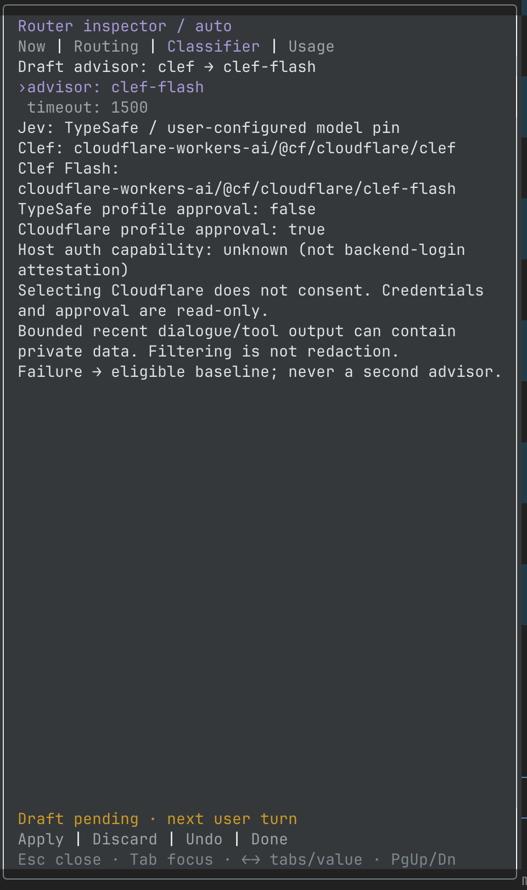
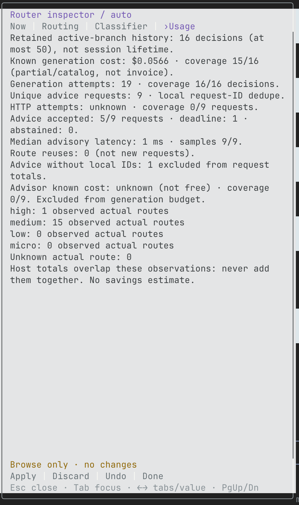
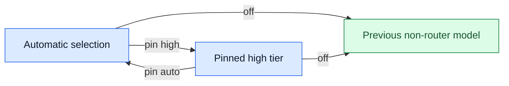

# User guide

A profile maps up to four tiers to models and reasoning effort.
The tiers are `micro`, `low`, `medium`, and `high`. They do not control tool permissions.
Pi supplies the providers, credentials, and tool permissions.

## First profile

1. Open Pi's `/model` selector to find available models.
2. Authenticate the chosen providers through Pi.
3. Create `~/.pi/agent/model-router.json`.
4. Add a profile to that file.

This example uses illustrative model references. Replace them with models and effort levels that your Pi registry supports.

```json
{
  "profiles": {
    "auto": {
      "baselineTier": "high",
      "high": { "model": "openai/gpt-6-astra", "thinking": "high" },
      "low": { "model": "openai/gpt-6-luna", "thinking": "off" }
    }
  }
}
```

5. Run `/router reload`.
6. Run `/router auto`.
7. Send a short request, such as `Reply with ready.`
8. Run `/router` to inspect the result.

With this profile and no active advisor or pin, the compact footer has this form:

```text
🚥 auto · high → gpt-6-astra/high · local baseline
```

The high route is the configured default, called the baseline. Prompt words do not select a cheaper local route.
If no route appears, use the [problem table](#common-problems).

## Understand the result

| Footer field | Meaning |
| --- | --- |
| `auto` | The selected profile name. It stays selected across model changes. |
| `high` | The tier used for this request. |
| `gpt-6-astra/high` | The model and reasoning effort selected for generation. |
| `local baseline` | No advisor selected the route. |
| `🧭 Jev → low c91% · 807ms` | Jev selected low with 91% confidence in this illustrative example. The advisor took 807 ms. |
| `reuse` | The router reused advice. The displayed advisor metrics belong to the original request. |
| `[fallback]` | Generation used an explicit alternative model. |

Confidence is not the probability of a correct answer.
`/router` shows more detail. The [Jev guide](jev-advisor.md#diagnostics) explains probability selection, abstention, and advisor errors.

## Native inspector

Run `/router-ui`, or open a section directly:
`/router-ui now`, `routing`, `classifier`, or `usage`.

- **Now:** current lifecycle, actual generation versus advice, pending settings and recent decisions.
- **Routing:** profile pin, baseline, soft generation budget and per-tier effort overrides.
- **Classifier:** Jev, Clef or Clef Flash selection, deadline and read-only authorization facts.
- **Usage:** at most 50 retained decisions, with explicit cost and request coverage.

Use Left/Right on the tab row to switch sections. Tab/Shift+Tab moves focus.
On a selector, Left/Right or Enter changes its value. Numeric fields use normal
text editing. Page Up/Down scrolls. Focus Apply, Discard, Undo or Done and press
Enter. Escape closes the inspector and returns input to Pi.

The inspector is a right-side overlay at 100 columns or wider. It covers,
rather than reflows, the transcript. Narrow terminals use a custom screen.
Resizing preserves the draft. Mouse input is not required. RPC and print modes
receive text instead of terminal components. Print mode writes diagnostics to stderr
(`pi --print '/router-ui usage' 2>&1`); JSON emits a `router-inspector` custom
message without starting inference. RPC uses the notification channel.



Edits share one draft across tabs. **Apply queues changed fields for the next
user turn**, not the next tool request. It never changes the displayed actual
route retroactively. Discard affects only the draft. Undo reverses only
unchanged editor-owned fields; conflicting external edits are rejected.

Pin, effort and baseline are profile-scoped and activate on that profile's next
user turn. Advisor selection, deadline and budget are session-wide and activate
on the next user turn even if you switch profiles. Nothing is written to a config file.
Activated pins/effort use existing branch-safe session persistence.
Pending edits and baseline/advisor/deadline/budget overrides reset on config
reload, session replacement or restart. Use the user configuration for durable settings.

Credentials and privacy consent are read-only. Selecting Clef does not authorize
sending context to Cloudflare. See [Cloudflare advisors](cloudflare-advisor.md).



Usage is **not lifetime accounting**. Run `/router log on` to collect decisions;
turning it off stops collection, and clearing it clears this view's source.
Advice is deduplicated by local request ID. HTTP attempts, generation attempts
and route reuses are different counts. Missing cost remains unknown. Host totals
overlap these observations and must not be added to them.

The images are actual Pi/agterm captures with deterministic synthetic data,
not the HTML prototype or live cost measurements.

## Try Jev next

1. Review the [privacy boundary](jev-advisor.md#privacy-boundary).
2. [Enable Jev](jev-advisor.md#enable-jev) for the same `auto` profile.
3. Send a new request.
4. Run `/router` again.

With multiple eligible routes and no policy bypass, status shows Jev advice or a reason for baseline fallback.
The selected tier can still be high. Different wording does not guarantee a different tier.

### Example session

These outcomes illustrate the flow. They are not fixed rules for particular prompts.

| Event | Example result |
| --- | --- |
| A new user request arrives. | Jev advises low. The router validates that choice and selects the low model. |
| The model receives a tool result. | A valid continuation keeps the actual route without another advisor call. |
| The user sends a new request. | The router can ask Jev again and select high. |
| The user pins high. | Later requests use the high tier and its explicit fallbacks without advice. |

## Take control


```mermaid
flowchart LR
    Auto["Automatic selection"] -->|"pin high"| Pin["Pinned high tier"]
    Pin -->|"pin auto"| Auto
    Auto -->|"off"| Off["Previous non-router model"]
    Pin -->|"off"| Off
    classDef policy fill:#dbeafe,stroke:#2563eb,color:#0f172a
    classDef generation fill:#dcfce7,stroke:#15803d,color:#14532d
    class Auto,Pin policy
    class Off generation
```

- Run `/router pin high` to restrict selection to high.
- Run `/router pin auto` to clear the pin.
- Run `/router off` to return to the previous non-router model.

Here, `auto` is a profile name. The argument in `pin auto` clears a pin instead.
An ineligible pin produces an error. The router does not substitute another tier.
A pin to a tier whose context window is too small for the conversation keeps that tier; old turns are truncated.

An effort override applies to every tier in the active profile.
Each model runs the override at its nearest supported level. For example, `off` runs as `minimal` on a model without `off`. The confirmation names each tier that runs another level, such as `high runs at minimal`.
Pi's thinking selector, such as Shift+Tab, sets the same override.
An override that removes every eligible route produces an error without a partial configuration change.
Use `/router thinking auto` to clear the override.

## Common problems

| Symptom | Action |
| --- | --- |
| No eligible route | Make sure that the model exists in `/model` and supports the input. Check `reasoning` and `thinkingLevels` in the configuration. |
| The baseline handles every request | Inspect `/router`. Enable an advisor for semantic selection, or clear a pin. |
| Jev does not run | Inspect the bypass reason and the [Jev diagnostics](jev-advisor.md#diagnostics). |
| Old behavior after an extension change | Start a new Pi session. |
| Provider context overflow | Reduce the active context. Text estimates cannot guarantee that images or a large tool turn fit. |

## Command reference

| Command | Action |
| --- | --- |
| `/router` | Show the current profile, route, costs, and diagnostics. |
| `/router <profile>` | Select a profile and enable the router. |
| `/router off` | Restore the previous non-router model. |
| `/router pin <tier\|auto>` | Pin a tier or return to automatic selection. |
| `/router thinking <level\|auto>` | Override effort for the profile or clear the override. |
| `/router log [on\|off\|clear]` | Show recent decisions, control collection, or clear history. |
| `/router widget` | Toggle the status widget. |
| `/router reload` | Load the configuration again. |
| `/router help` | Show command help. |
| `/router-ui [now\|routing\|classifier\|usage]` | Open the native inspector, or return text outside TUI. |

Per-tier effort can be set in the profile configuration or as a session override in the inspector.
Removed commands such as `status`, `profile`, `fix`, and `debug` show their replacements unless a configured profile has that name.

## Configuration reference

| File | Purpose |
| --- | --- |
| `~/.pi/agent/model-router.json` | User configuration and external-advisor approval. A custom Pi agent directory changes this location. |
| `.pi/model-router.json` | Project overrides for routes, the Pi classifier, and display. Project Jev, Cloudflare, advisor-selection and advisor-consent settings have no effect. |
| `~/.pi/agent/model-router-state.json` | Last selected profile. The extension manages this file. |

CAUTION: Keep credentials out of Git. Selected conversation text can contain secrets even with bounded advisor context.

A profile needs at least one tier. A partial profile is valid.
Profile names must be nonempty, contain no whitespace, and not match an active command: `pin`, `thinking`, `log`, `widget`, `off`, `reload`, or `help`. Invalid names are ignored with a warning; rename these profiles before reloading.
The router filters unavailable models and unsupported input before selection. An unsupported effort runs at the nearest supported level.
`baselineTier` prefers a configured tier. Without it, the preference is `medium`, `high`, `low`, then `micro`.
The [complete example](../model-router.example.json) shows aliases, all four tiers, and explicit fallbacks.

| Field | Behavior |
| --- | --- |
| `maxSessionBudget` | Soft threshold for reported generation cost. Unpinned requests skip advisors and prefer eligible medium-or-lower tiers after this threshold. |
| `classifierModel` | Optional chat-based Pi classifier, active only on the default Jev path when Jev is inactive. Accepts a model reference or `{ "model", "thinking", "timeoutMs" }`. |
| `advisor` | User-only `jev` (default), `clef`, or `clef-flash`. See [Cloudflare advisors](cloudflare-advisor.md). |
| `cloudflare` | User-only Cloudflare enablement and bounded tuning; per-profile approval is separate. |
| `models` | Aliases with a `model` reference and optional `contextWindow` and `maxTokens`. |
| `ui.statusLine` | `compact` by default. `detailed` adds advisor probability, request time, and cache counters. |

Budgets and model capacities must be positive, finite numbers. Invalid values are ignored with a warning.
The budget is not a spending cap. It excludes advisor costs, and a pin takes priority.
Without an eligible lower tier, the budget policy keeps an eligible baseline.
The classifier timeout defaults to 10 seconds. A classifier error selects the baseline.
User or project configuration can set `classifierModel`. It sends bounded recent conversation text through the configured Pi model; Jev approval does not govern this separate path.

## Read costs and cache data

After a terminal response, detailed status and the log expose:

- Input, output, cache-read, and cache-write tokens for the last terminal attempt.
- The model transition and the total attempt count.
- Reported catalog cost across attempts, with failed attempts included.
- Hypothetical stay/switch prices for the same measured tokens.

An attempt without terminal usage makes the request total unknown. The session total still includes known costs.
Zero placeholder tariffs do not establish free generation.
Catalog prices do not establish subscription charges.

The shadow comparison does not control routes or predict savings.
It assumes either all-cache-read input or all-new input, plus the same output tokens.
Missing tariffs, an unknown previous model, and router-side truncation suppress the comparison.
The [evaluation](evaluation.md) separates observed use from hypothetical cost.

## Sessions and history

Pins, costs, display controls, and recent decisions follow the Pi session branch.
Debug collection retains the last 50 decisions. Turning collection off preserves existing history and the latest decision.

An explicit startup `--model` takes priority.
Otherwise, a resumed branch uses its saved state.
When Pi starts on the router provider, a new session uses the last profile.
A restored router snapshot does not restore a server cache.

## Migration

### From 0.9.x to 0.10.0

Jev authentication has moved to Pi. Before upgrading, run `/login typesafe` or
provide `TYPESAFE_API_KEY` to Pi. After installing 0.10.0, start a new Pi session
and follow the [Jev field migration](jev-advisor.md#migrate-the-old-router-fields).
Without a Pi credential, enabled Jev falls back to baseline, not the chat classifier.
A custom legacy endpoint stays disabled until explicitly migrated.

The native inspector is `/router-ui`; existing `/router` commands remain.
Cloudflare is opt-in and does not inherit Jev approval.


CAUTION: Do not load this fork and the upstream extension together. Both register the `router` provider.

```sh
pi remove npm:@yeliu84/pi-model-router
pi install npm:@alexeiled/pi-model-router
```

If a manifest loads the upstream extension, remove that entry instead.
Deprecated `rules` and `phaseBias` produce a warning but have no routing effect.
